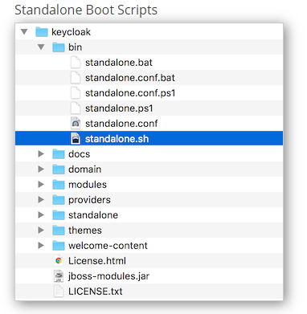
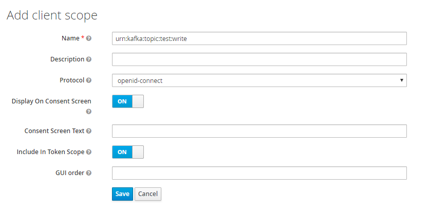
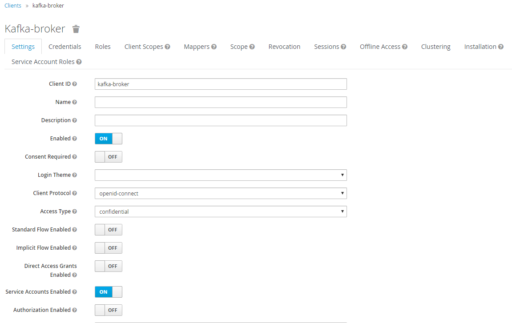
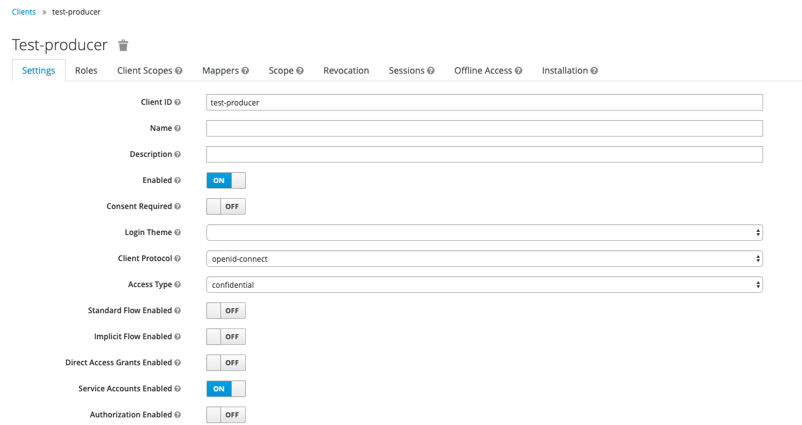
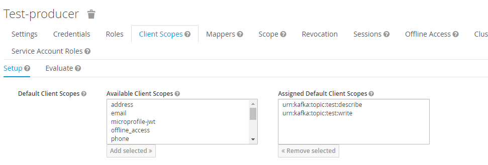
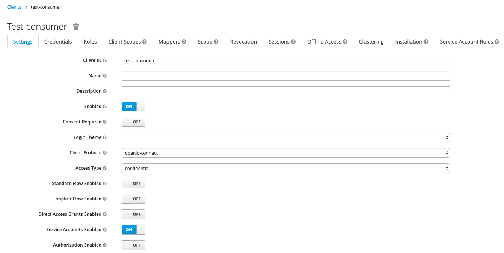
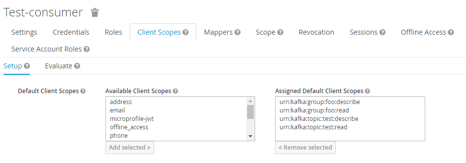
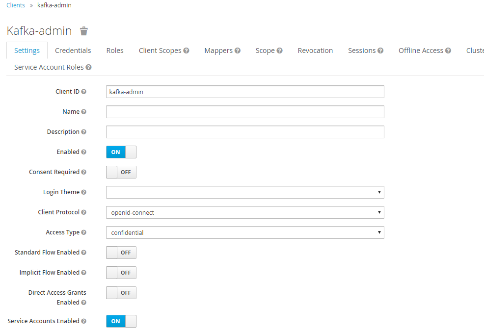
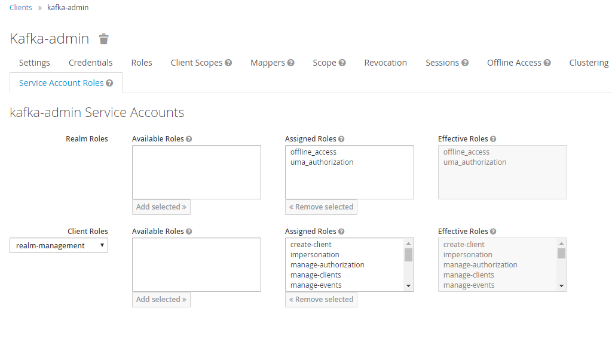

Copyright © 2020 BlackRock Inc.

Licensed under the Apache License, Version 2.0 (the "License");
you may not use this file except in compliance with the License.
You may obtain a copy of the License at

  http://www.apache.org/licenses/LICENSE-2.0

Unless required by applicable law or agreed to in writing, software
distributed under the License is distributed on an "AS IS" BASIS,
WITHOUT WARRANTIES OR CONDITIONS OF ANY KIND, either express or implied.
See the License for the specific language governing permissions and
limitations under the License.

# KeyCloak Setup

- Download version 6.01 of KeyCloak Standalone Server from the following:
    - https://www.keycloak.org/downloads.html
    - Unzip to a preferred file location
    - Run the standalone file to start KeyCloak
        - If you wish to learn more about the KeyCloak configuration follow this link:
        - https://www.keycloak.org/docs/latest/server_installation/index.html#_standalone-mode
    
   

- Navigate to your running KeyCloak instance:
    - http://localhost:8080

## Create Admin User
- The first time you navigate to the administration console you have to create administrator user. 
- Create an admin user, and login into the administration console.

## Create Client Scopes
- Create the KeyCloak client scopes that represent topics and kafka brokers that need to be secured.
- Client scopes are defined using the Uniform Resource Name (URN) format.

        urn:kafka:{resourceType}:{resourceName}:{operation}

 * resourceType: topic, group, cluster
 * resourceName: The name of the resource (topic name, group name, cluster name). 
 * operation: read, write, create, delete, alter, describe, cluster_action

- Please see Kafka documentation for valid combinations of resource types to operations.
    - [List of Kafka Operations and Resource Types](https://docs.confluent.io/current/kafka/authorization.html#acl-format)

##### For this example we will be using a topic called "test" and a consumer group called "foo".

#### Kafka Broker Client Scopes
- To allow the broker to be authorized the following scopes need to be created.

        urn:kafka:cluster:kafka-cluster:cluster_action

#### Kafka Producer Client Scopes
- Producers will need to be able to write and describe on a topic. 

        urn:kafka:topic:test:describe
        urn:kafka:topic:test:write 

#### Kafka Consumer Client Scopes 
- Consumers will need to be able to read and describe both a group and a topic.

        urn:kafka:topic:test:describe
        urn:kafka:topic:test:read 
        urn:kafka:group:foo:describe
        urn:kafka:group:foo:read

##### Create the Scopes in KeyCloak
- To create a Client Scope navigate to the Client Scopes tab in the left menu.
- Click create on the upper left hand corner of the table
- Complete the form with the valid URN scope formatted name

For Example:

  

## Create Kafka Broker Client
- Create a "kafka-broker" client that represents the Kafka application that needs to perform cluster operations.
- Make sure to enable the service account feature, this will allow the client to be authenticated and authorized in Kakfa.

For Example:

  

#### Grant Kafka Broker Client Scopes
- Assign the broker scope specified above to the "kafka-broker" client

For Example:

  

## Create Test Producer Client
- Create a "test-producer" client that represents the Kafka application that needs to perform read/describe operations.
- Make sure to enable the service account feature, this will allow the client to be authenticated and authorized in Kakfa.

For Example:

  

#### Grant Test Producer Client Scopes
- Assign the producer scopes specified above to the "test-producer" client

For Example:

  

## Create Test Consumer Client
- Create a "test-consumer" client that represents the Consumer application that needs to perform write/describe operations.
- Make sure to enable the service account feature, this will allow the client to be authenticated and authorized in Kakfa.

For Example:

  

#### Grant Test Consumer Client Scopes
- Assign the consumer scopes specified above to the "test-consumer" client

For Example:

  
    
## Optional - Create Admin Client
- This is an admin service account to use from the CLI.
- The customized CLI will interact with the KeyCloak API to create a scope and add it to a specified client.
    - To be able to interact with the KeyCloak API an admin client is required.
- Create a new client called "kafka-admin"

For Example:

  

#### Assign Service Account Roles
- Add realm management roles

 
 

